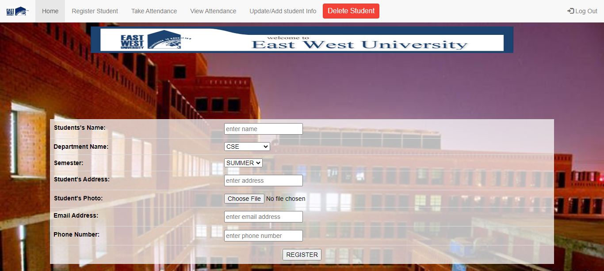
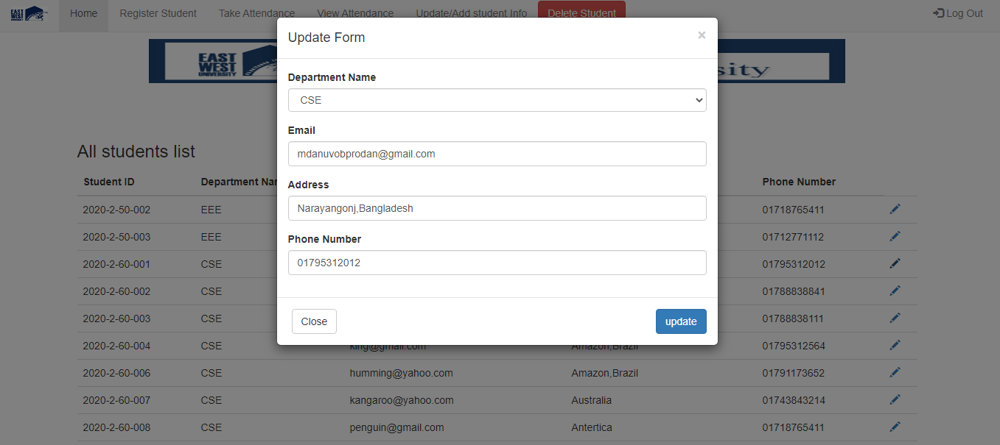

# Online-Attendance-and-Student-Information-Management-System
A web based project to manage student's attendance and information. This system contains two types of user. One is instructor and another one is student. If the user is an instructor then he/she can take attendance of students within the course schedule and can also view the attendance history anytime. Instructors can also register a new student’s information with proper validation and also can update student’s information. And if the user is a student then he/she can view his/her profile and can update some information of his/her profile.

Programming language: PHP, JavaScript.

Database: MySQL.

For web page design: HTML, CSS, and Bootstrap.

## Snapshot 1:(Home Page)

## Snapshot 2:(Admin Login Page)

## Snapshot 3:(Student Account Registration Page)

## Snapshot 4:(Attendance Page)

## Snapshot 5:(Attendance History)

## Snapshot 6:(Student Account Info Update/Add Page)

## Snapshot 7:(Validation in Info Update/Add Page)

## Snapshot 8:(Student Account Delete Page)

## Snapshot 9:(Student Profile Page)

## Snapshot 10:(Student Profile Update page)

